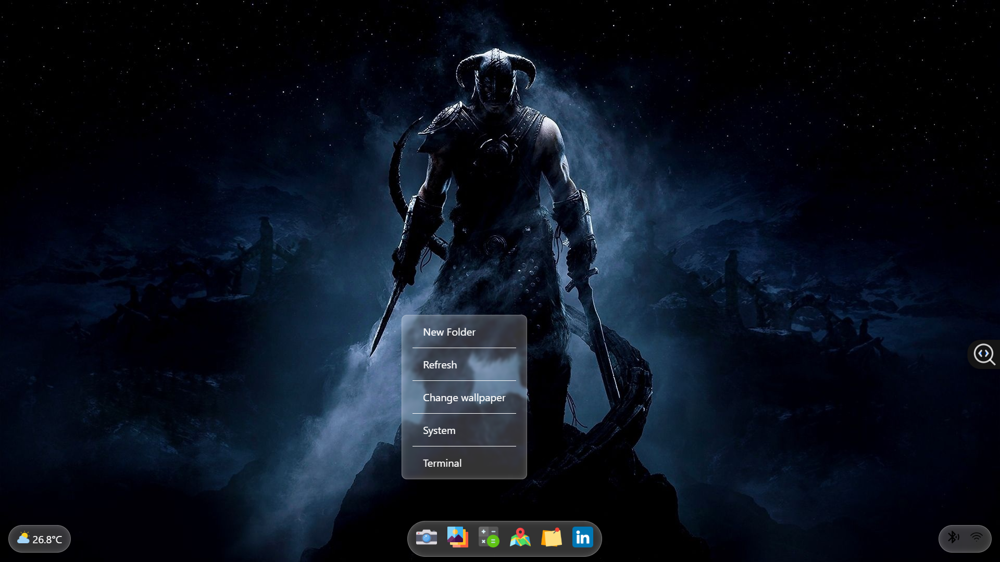
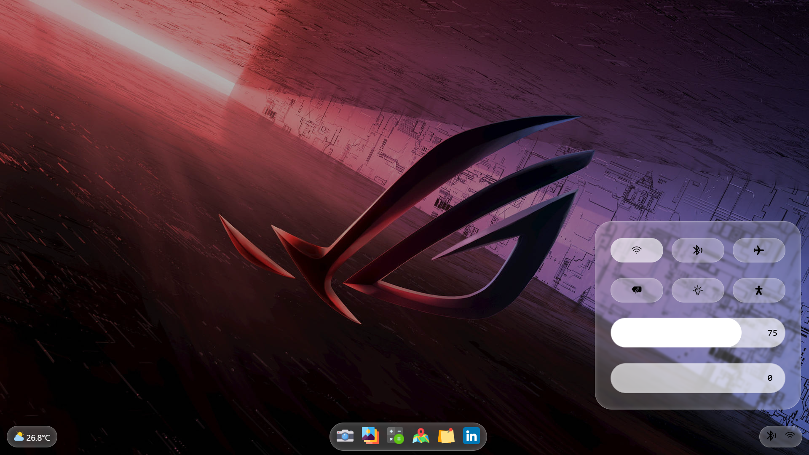
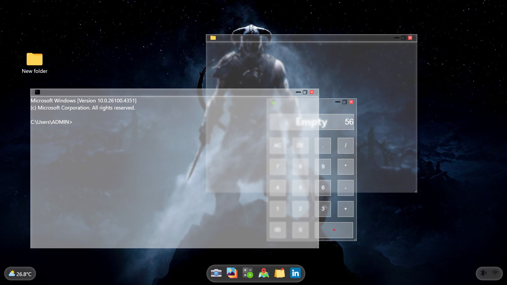
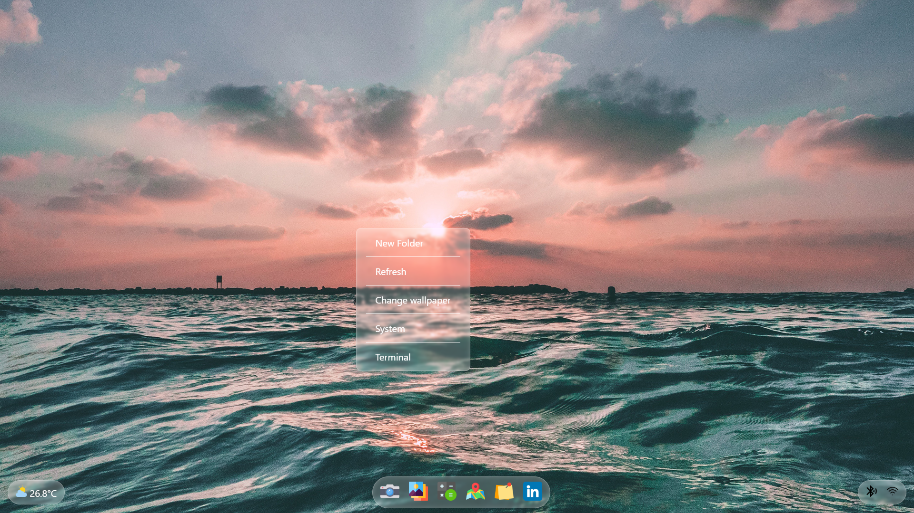
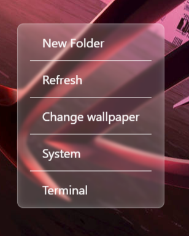

# 🌐 Web-Based Operating System UI

A desktop-like operating system built entirely using **HTML, CSS, and JavaScript**. This interactive project mimics an OS environment with draggable windows, right-click context menu, folder creation, brightness control, wallpaper change, and more — all inside your browser!

## 🔗 Live Demo

[Click here to try it out](https://operating-system-mocha.vercel.app/)  

---

## ✨ Features

- 🖱️ Right Click Context Menu
- 📁 Create / Open / Close Folders
- 🧩 Drag and Drop Window Functionality
- 🎨 Dynamic Wallpaper Change
- 🔆 Brightness and 🔊 Volume Controls
- ➕ Simple Calculator App
- ❌ Close Windows Option
- 📂 Responsive Design (Desktop-first)

### 🧠 Upcoming Features

- 💻 Terminal Simulation
- 📝 Notes App
- 🎵 Music Player
- 🗑️ Recycle Bin
- 🕒 Clock & Calendar
- 🔐 Login Page

---

## 🛠️ Tech Stack

- HTML5
- SCSS/CSS3
- JavaScript (Vanilla)
- DOM Manipulation

---

## 📸 Screenshots

_(optional - add actual images from your project folder)_

| Desktop View                      | Wallpaper Switch               | Context Menu                     |
| --------------------------------- | ------------------------------ | -------------------------------- |
|     |  |  |

---

## 📁 Folder Structure

```bash
📦 OPERATING SYSTEM
 ┣ 📂 Assets
 ┣ 📂 screenshot
 ┣ 📄 index.html
 ┣ 📄 Readme.md
 ┣ 📄 script.js
 ┣ 📄 style.scss
 ┣ 📄 style.css
 ┗ 📄 style.css.map
```
